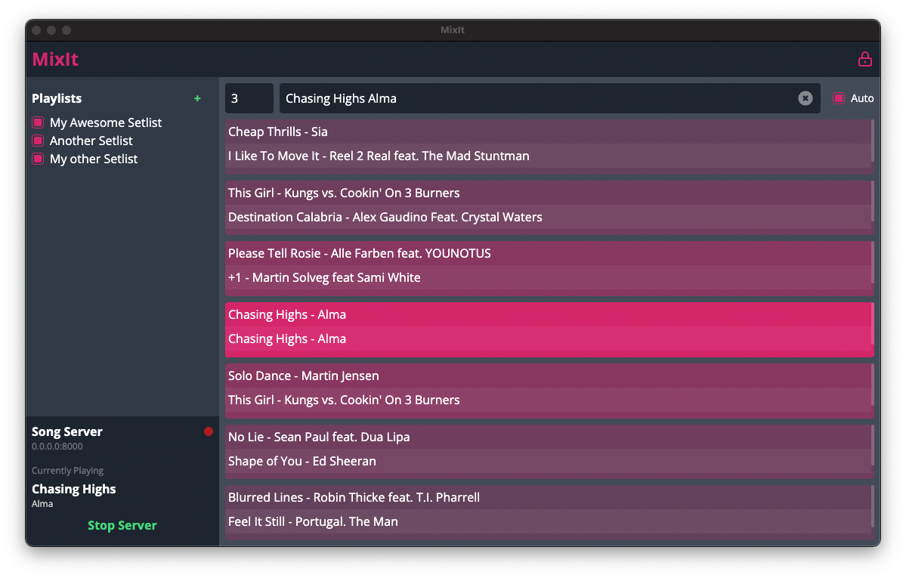

#  MixIt 🎧🔥

A song recommendation tool for DJs

## Quick Look

## About
MixIt is a tool that can help you in your song selection process.

By importing some of your previous playlists (i.e. histories), the tool shows you which songs you previously played before/after a given song.

### Usage

0. Before you start, you want to export a selection of your previous histories in a supported playlist format. The supported formats are Traktor playlists (i.e. `.nml`) and iTunes Playlists in XML forma (i.e. `.xml`).
1. Once you've got the playlists ready, you can open the application and import those playlists. Do this by clicking the `+` button in the left side navigation.
2. After you imported your playlists, they will be shown in the side navigation. From there, you can select which playlists the tool should include when searching for a track.
   - If you want to remove a playlist again, you first have to unlock the configuration by clicking the lock icon in the top-right hand corner. Afterwards, you can click on the delete icon next to a playlist.
3. Now that you have imported and selected some of your playlists, you can type the name of a song in the search field.
   - The tool will now show you all the songs that matched your search text in the central row
   - In the rows above/below it shows you which songs you played before and after the song(s) respectively
   - You can select how many songs before/after should be displayed using the spinner/number input on the left of the search field
4. If you want to fill in the name of your currently playing song while you are in the mix, you can connect Traktor to the tool
   - Below the playlist section, you find the `Song Server` section. If the config is unlocked, you can set a hostname and port for where you want to run the song server.
   - Afterwards, you can click on `Start Server` to run the server. When the server started successfully, a red indicator will flash.
   - Now, you can connect Traktor. Open your Traktor settings and go to the `Broadcasting` section. Enter the hostname and port of where you just started the song server.
   - To prevent unnecessary data transfer, you can select the lowest data rate possible for the stream
   - Once this is configured, close the settings again. Now, open the recording section of Traktor (this is located where the effect panels are, you have to switch the tab by clicking on the record icon)
   - Once you identified the section, click on the "radar tower" icon to start broadcasting.
   - If a connection is established, the "radar tower" icon in traktor should have a solid color (i.e. not flash). In addition, the MixIt tool will signal an active connection by showing the red indicator light constantly (i.e. not flashing anymore)
   - Now just start playing songs and MixIt will receive the song data
   - IMPORTANT: MixIt will receive the song data as soon as Traktor flags a song as being played (i.e. the time it is added to the history). It can make sense to increase this time to prevent false changes of the song if you just quickly played into a song. To do this, open the `Transport` section of the settings. There, you have the option to increase the minimal playtime until a song is marked as being played.

## Project Structure

The project is structured into two folders, one for the user-facing application (i.e. `/frontend`) and one for the electron functionality (i.e. `/electron`)

### Frontend
The frontend folder contains the web app's source code. The application is developed using the React framework and the Create React App CLI.

The frontend shares the `src/models` directory with the electron folder to have streamlined data types.

### Electron
The electron folder contains all device-specific functionality (e.g. song server, file import, ...).

The frontend communicates to the electron base via IPCs. Those calls are wrapped behind a frontend-facing API, which is defined in the `preload/index.ts`.

## Building
If you want to build a standalone application, perform the following steps:

0. Make sure the dependencies are installed `npm --prefix="frontend" i && npm --prefix="electron" i`
1. Navigate to the electron folder `cd electron`
2. Run the make script `npm run make`
3. The generated application will be written to the `/out` folder

## State of this Application & Feedback
This project is just a passion project of mine and does not claim to be "production ready" in any way shape or form. I encourage you to test it out for yourself and see if it fits for you.

In case you have and feedback/issues/feature request, please just create an issue in this project.
